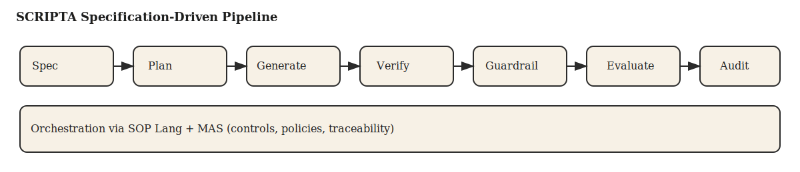

# DS06 Architecture & Code Plan — SCRIPTA

## 1. Architectural Overview
SCRIPTA is a modular multi-agent system inside the ACHILLES IDE. It follows a pipeline: Spec → Plan → Generate → Verify → Guardrail → Evaluate → Audit.

## 2. Core Components
- Spec Manager: CRUD for narrative specs and SOPs.
- Planning Agent: converts creative intent into plot graphs.
- Generation Agents: scene-level prose generation.
- Verification Agents: coherence, consistency, logic checks.
- Guardrail Agents: bias, originality, copyright checks.
- Evaluation Engine: metrics computation and dashboards.
- Audit Logger: immutable event and provenance store.
- CNL Translator: converts natural language constraints into a controlled format.
- VSA/HDC Module: hyperdimensional representations for semantic indexing and retrieval.

## 3. Interfaces
- SOP Lang orchestration for workflows.
- Standardized agent I/O contracts (JSON schema).
- Artifact registry for generated text and reports.
- Dual implementation contract: every algorithm has Basic and VSA/HDC variants with a shared interface.

## 4. Repository Structure (Proposed)
- docs/specs: design specifications.
- src/agents: agent implementations and policies.
- src/pipelines: SOP Lang definitions.
- src/services: API services (spec, plan, verify, guardrail, audit).
- src/evaluation: metrics and benchmark scripts.
- src/cnl: CNL grammar, parsers, validators, and translators.
- src/vsa: hyperdimensional encoding, binding, and retrieval.
- src/server.mjs: dependency-free HTTP API stub for tests and demos.
- tests: unit, integration, and evaluation tests.

## 5. Testing Strategy
- Unit tests for each agent.
- Integration tests for end-to-end pipelines.
- Regression tests for metrics and guardrails.
- Golden outputs for repeatable evaluation.
- A/B tests for Basic vs VSA/HDC algorithm variants.

## 6. Observability & Telemetry
- Per-agent latency and error rates.
- Token usage and cost tracking.
- Traceable pipeline runs via correlation IDs.
- Algorithm variant tracking to compare Basic and VSA/HDC performance.

## 7. Security & Compliance
- Signed audit logs.
- Access control per role.
- PII redaction hooks.

## 8. Implementation Milestones
- M1: Spec + planning pipeline.
- M2: Generation + verification integration.
- M3: Guardrail and evaluation services.
- M4: Full auditability and compliance reporting.
