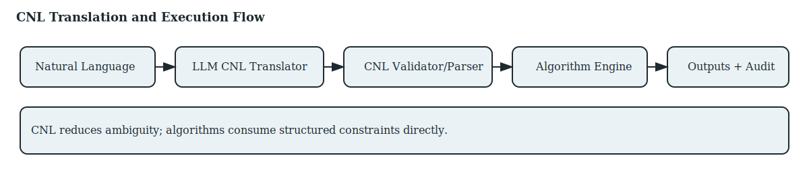

# DS09 Controlled Natural Language (CNL) Plan — SCRIPTA

## 1. Purpose
Define a Controlled Natural Language layer that converts author intent into structured, machine-checkable constraints for algorithms and verification.

## 2. CNL Goals
- Reduce ambiguity in narrative requirements.
- Enable deterministic constraint checking.
- Provide traceable mapping between NL intent and algorithm inputs.

## 3. CNL Flow

## 4. Components
- NL Intake: author intent in natural language.
- LLM Translator: converts NL to CNL with provenance metadata.
- CNL Validator/Parser: validates grammar and schema conformance.
- Constraint Store: normalized CNL constraints bound to spec_id.
- Algorithm Engine: consumes CNL directly for verification and planning.

## 5. Example CNL (Illustrative)
- CHARACTER(Anna). TRAIT(Anna, courageous).
- RULE(Scene_3, must_include, "storm").
- GOAL(Anna, protect, "brother").

## 6. Grammar & Schema
- Formal grammar defined in src/cnl/grammar.ebnf.
- Schema versioned and referenced in audit logs.
- Validation returns structured error diagnostics.
- Prototype validator implemented in src/cnl/validator.mjs.

## 7. Translation Strategy
- Primary: LLM translation with deterministic post-validation.
- Fallback: rule-based extraction for simple patterns.
- Rejection: invalid CNL triggers user clarification loop.

## 8. KPIs
- CNL Parse Success Rate (CPSR) >= 95%.
- Constraint Satisfaction Accuracy (CSA) >= 98%.
- User correction rate below 10% after two iterations.

## 9. Risks & Mitigations
- Risk: LLM hallucination in CNL output.
  - Mitigation: strict validation + auto-repair hints.
- Risk: CNL expressiveness too limited.
  - Mitigation: iterative grammar expansion with versioned schemas.

## 10. Deliverables
- CNL grammar and parser.
- CNL translation service endpoints.
- Validation tests and benchmark datasets.
