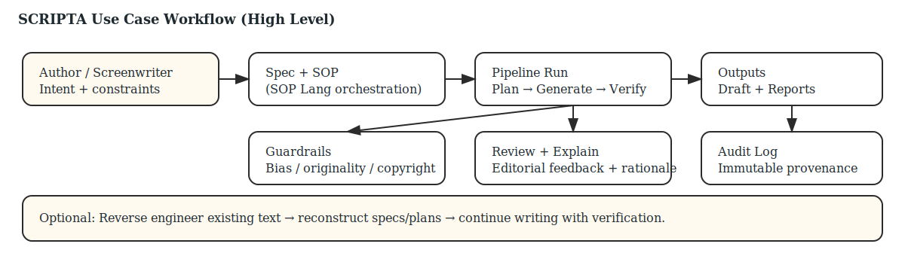

# DS15 Use Case Definition — SCRIPTA

## 1. Purpose
Define the SCRIPTA use case in terms of actors, workflows, boundaries, and key artifacts, aligned to the ACHILLES specification-driven paradigm.

## 2. Use Case Name
SCRIPTA — Scripts Certification and Review. Integrity of Processes and Trust Assurance.

## 3. Problem Statement
LLM-driven writing tools often behave as opaque "magic boxes" that produce fluent text but:
- drift from long-range narrative intent,
- introduce legal/ethical risks (copyright, stereotypes),
- lack auditability and explainability.

SCRIPTA addresses these issues via specification-first co-creation, multi-agent orchestration, verification, and compliance reporting.

## 4. Actors
- Author / Screenwriter: sets intent, constraints, accepts/rejects proposals.
- AI Workflow Developer: designs SOP templates and reusable pipelines.
- Publisher / Studio: consumes drafts and compliance evidence.
- Legal / Compliance Officer: reviews audit logs and compliance reports.
- System Agents (MAS): planning, generation, verification, guardrail, review, research.

## 5. Primary Inputs
- Natural language intent (story brief, research brief).
- Constraints (style, tone, safety, originality, legal requirements).
- Optional reference material and user-provided notes.

## 6. Primary Outputs
- Structured artifacts: NarrativeSpec, SOP, Plan.
- Content artifacts: Draft chapters/scenes.
- Reports: VerificationReport, GuardrailReport, ReviewReport, ComplianceReport.
- Immutable Audit Log entries linking inputs → steps → outputs.

## 7. Main Workflow (Happy Path)
1. Create a NarrativeSpec describing plot constraints, characters, and world rules.
2. Select or author an SOP (SOP Lang) to orchestrate planning, generation, and verification.
3. Run planning to generate a Plan (plot graph + scenes).
4. Generate text scene-by-scene (draft artifacts).
5. Verify coherence and constraint satisfaction against the spec.
6. Run guardrails for bias/originality/copyright signals.
7. Request literary review feedback and explanations (XAI) for suggested edits.
8. Produce a compliance report and export final draft with provenance.

## 8. Alternative Workflows
- Reverse engineering: ingest an existing draft, reconstruct a spec/plan, then continue writing.
- Research-assisted writing: run research queries and attach provenance to factual inserts.
- Human-in-the-loop editing: author edits spec and draft iteratively; pipeline re-runs.

## 9. Boundaries and Assumptions
- SCRIPTA is not autonomous authorship; the human remains the creative director.
- External web research is optional and subject to policy; provenance is mandatory.
- Formal verification may start as heuristics, but interfaces must support proof artifacts later.

## 10. Traceability (Artifacts)
- Each pipeline run produces:
  - selected SOP version,
  - agent versions and parameters,
  - input hashes,
  - output artifact references,
  - audit log linkage.
